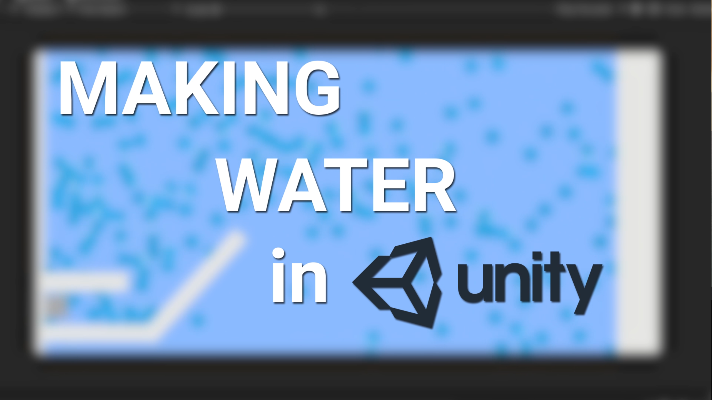

# Unity Fluid Simulation
A Unity Realtime Fluid Simulation using SPH and Unity

  

  

Implementing smoothed particle hydrodynamics (SPH) in C# using this <a href="https://web.archive.org/web/20090722233436/http://blog.brandonpelfrey.com/?p=303" target="_blank">tutorial</a>.

Currently supports 1000 particles at 30 fps realtime on an Intel I7-12700 CPU using spatial partitioning.

See also the Python implementation <a href="https://github.com/AlexandreSajus/Python-Fluid-Simulation" target="_blank">here</a>.

I also made a devlog about this project here:

  

